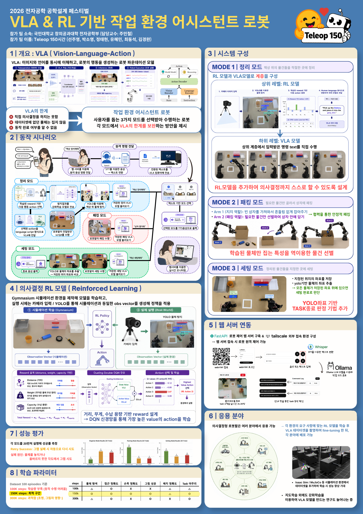

# VLA & RL 기반 작업 환경 어시스턴트 로봇

> 2026 전자공학 공학설계 페스티벌

<p align="center">
  
</p>

---

## 개요

사용자의 음성 명령을 듣고 **3가지 모드**를 선택하여 수행하는 작업 환경 어시스턴트 로봇입니다.  
각 모드에서 VLA(Vision-Language-Action) 모델의 한계를 보완하는 방안을 제시합니다.

| 한계 | 해결 방안 |
|------|----------|
| 직접 의사결정을 하지는 못함 | RL 모델을 추가하여 의사결정까지 스스로 할 수 있도록 설계 |
| 데이터셋에 없는 물체는 잡지 못함 | 학습된 물체만 집는 특성을 역이용한 물건 선별 |
| 동작 완료 여부를 알 수 없음 | YOLO 기반 TASK 판정 기법 추가 |

---

## 시스템 구성

### MODE 1 | 정리 모드
RL 모델과 VLA 모델로 **계층을 구성**하여 책상 위 물건을 자동 정리합니다.
- **상위 레벨 (RL)**: YOLO로 물체를 감지하고, DQN이 "어떤 물체를 어디에 넣을지" 결정
- **하위 레벨 (VLA)**: 입력받은 명령 text를 직접 수행

### MODE 2 | 패킹 모드
필요한 물건만 골라서 공구상자에 담습니다.
- 학습된 물체만 집는 특성을 역이용한 물건 선별

### MODE 3 | 세팅 모드
필요한 물건들을 지정한 위치에 세팅합니다.
- YOLO 기반 TASK 판정 기법으로 동적 판로 결정

---

## 동작 시나리오

```
사용자 음성 입력
    → Whisper STT (음성→텍스트)
    → Ollama LLM (텍스트→모드 분류)
    → 모드 실행 (VLA + RL)
    → 로봇 동작
```

---

## 의사결정 RL 모델

- **환경**: Gymnasium 기반 DeskCleanEnv (4물체 × 4수납함)
- **알고리즘**: Dueling DQN
- **보상 설계**: 거리, 무게, 수납 용량 기반
- **실행 시**: YOLO 감지 → observation vector 생성 → RL policy → action 결정

---

## 웹 서버 연동

- FastAPI 기반 웹 서버 + Tailscale Funnel로 외부 HTTPS 접속
- JSMpeg 실시간 영상 스트리밍
- Whisper STT + Ollama LLM 모드 분류
- 데몬 방식 policy preloading으로 즉시 실행

---

## 프로젝트 구조

```
├── src/lerobot/
│   ├── scripts/
│   │   ├── lerobot_project.py        # CLI 시연 스크립트
│   │   ├── lerobot_record_daemon.py  # 웹 서버용 데몬 (policy preload)
│   │   ├── lerobot_record_web.py     # 웹 서버용 record
│   │   ├── RL_deploy.py              # RL 추론 (Dueling DQN)
│   │   ├── RL_train.py               # RL 학습
│   │   ├── gym_env.py                # RL 환경 (DeskCleanEnv)
│   │   ├── yolo_detect.py            # YOLOv8 물체 감지
│   │   └── tts.py                    # 음성 합성
│   ├── policies/                     # SmolVLA 등 VLA 모델
│   ├── robots/                       # SO101 bimanual follower
│   ├── cameras/                      # OpenCV 카메라
│   └── ...
├── web/
│   ├── main.py                       # FastAPI 웹 서버
│   ├── start.sh                      # 실행 스크립트
│   ├── static/                       # 프론트엔드 (JS, 영상)
│   └── templates/                    # HTML 템플릿
├── pyproject.toml
└── .gitignore
```

---

## 실행 방법

### CLI 모드 (로봇 직접 연결)
```bash
conda activate project
cd ~/lerobot
pip install -e ".[smolvla]"
lerobot-project
```

### 웹 서버 모드
```bash
conda activate web_test
cd ~/lerobot/web
./start.sh
# 외부 접속: sudo tailscale funnel --bg --https=443 http://127.0.0.1:8000
```

---

## 학습 파라미터

| 항목 | 값 |
|------|-----|
| Base model | SmolVLA (HuggingFaceTB/SmolVLM2-500M-Video-Instruct) |
| Dataset | 100 episodes 기준 |
| Steps | 100K~150K |
| Batch size | 12 |
| FPS | 30 |


---

## 브랜치 구조

| 브랜치 | 용도 |
|--------|------|
| `main` | HuggingFace lerobot 원본 (최신) |
| `v0.4.5-py310` | 프로젝트 전체 (녹화 + 학습 + deploy) |
| `v0.5.2-py312` | groot/pi0fast 실행용 |
| `project` | **프로젝트 실행 전용 (최소 구성)** ← 현재 브랜치 |
